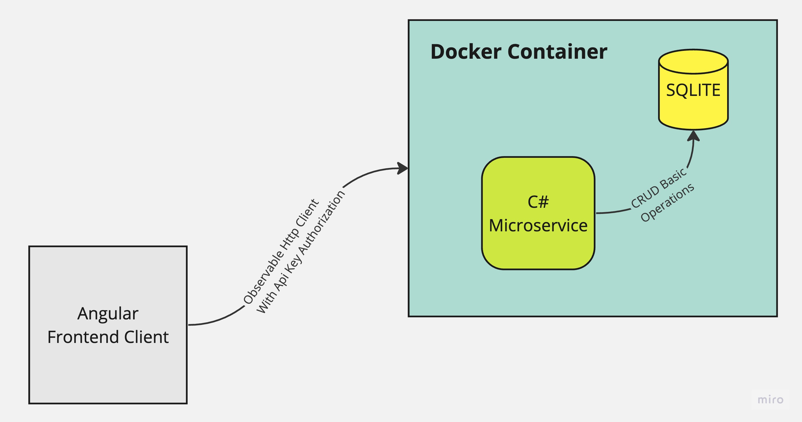

# Farmfresh
FarmFresh is an online supermarket offering a huge range of grocery products with deals and exclusive promotions. Its catalogue includes fresh groceries, household essential, and specialty products. FarmFresh also offers lifestyle tips to educate their target audience on the importance of healthy living.



## Postman Documentation

https://documenter.getpostman.com/view/27639891/2s93sgWVep

## Backend

Technology stacks used for this project
- Docker
- .NET Core 7
- SQLite Database
- Entity Framework (Code First) with generic repository

### How To Run

```
docker build -t farmfresh .
docker run -p 5014:80 -p 4430:443 --name farmfresh-net -d -i farmfresh
```

## Frontend

Technology stacks used for this project
- Angular 16
- Angular Bootsrap Component

### How To Run

```
npm install
ng serve --open
```